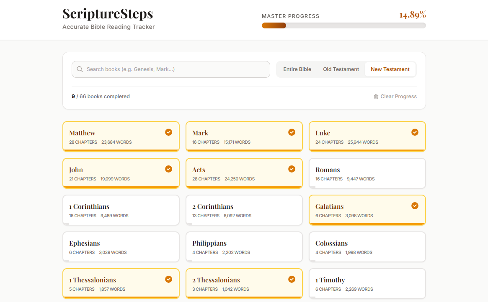

<p align="center">
  <a href="https://github.com/DochertyDev/ScriptureSteps">
    
  </a>
</p>

<h1 align="center">
ScriptureSteps
</h1>

<h2 align="center">Bible Progress Tracker</h2>

<div align="center">

 [](LICENSE) [](https://github.com/DochertyDev/ScriptureSteps)

</div>

:star: _Love ScriptureSteps? Give us a star to help other developers discover it!_

<br />

<div>

</div>

---

## 📋 Table of Contents

- [Overview](#-overview)
  - [Features](#features)
- [Quick Start](#-quick-start-local-development)
  - [Prerequisites](#prerequisites)
  - [Setup Instructions](#setup-instructions)
- [Usage](#️-usage)
- [Technologies Used](#️-technologies-used)
- [Security Notes](#-security-notes)
- [Troubleshooting](#-troubleshooting)
- [Contributing](#-contributing)
- [Support the Project](#-support-the-project)
- [Disclaimer](#️-disclaimer)

## 📄 Overview

ScriptureSteps is a web application designed for users who want to track their Bible reading progress in a more detailed and accurate way. Unlike traditional trackers that simply mark chapters as read, ScriptureSteps calculates progress based on the total word count of each book. This method provides a more granular and representative measure of completion. The application is built with React and TypeScript, runs entirely in the browser, and saves all progress locally to your device, ensuring your data remains private.

### Features

-   **Word-Count Based Tracking:** Progress is calculated based on the word count of each book and chapter, offering a more accurate reflection of your reading journey.
-   **Comprehensive Visuals:** An overall progress bar shows your total progress through the entire Bible, while individual cards for each book display their specific completion status.
-   **Client-Side Storage:** All your reading data is securely saved in your browser's `localStorage`, meaning you don't need an account and your data stays with you.
-   **Book & Chapter Granularity:** Mark entire books as read with a single click or track your progress chapter-by-chapter for more detailed management.
-   **Modern & Responsive Interface:** A clean and intuitive user interface built with modern web technologies, ensuring a seamless experience on both desktop and mobile devices.

## 🚀 Quick Start (Local Development)

This project includes a simple build process for local development.

### Prerequisites

-   Node.js (v18.x or later recommended)
-   npm (comes with Node.js)

### Setup Instructions

1. Clone the repository:

    ```sh
    git clone https://github.com/DochertyDev/ScriptureSteps.git
    ```

2. Navigate to the project directory:

    ```sh
    cd ScriptureSteps
    ```

3. Install the required dependencies:
    ```sh
    npm install
    ```

4. Start the local development server:
    ```sh
    npm run dev
    ```

## ⚙️ Usage

Once the application is running, you can start tracking your progress right away.

1.  **View Progress:** The main screen displays an overall progress bar and a card for each book of the Bible.
2.  **Interact with Books:** Click on a book's card to expand it and see the list of chapters.
3.  **Track Chapters:** Click on individual chapter numbers to mark them as read or unread.
4.  **Mark Books:** Use the "Mark as Read" or "Mark as Unread" button on the book card to update the entire book at once.
5.  **Automatic Saving:** Your progress is saved automatically every time you make a change.

## 🛠️ Technologies Used

-   **React:** A JavaScript library for building user interfaces.
-   **TypeScript:** A typed superset of JavaScript that compiles to plain JavaScript.
-   **Vite:** A modern frontend build tool that significantly improves the development experience.
-   **Tailwind CSS:** A utility-first CSS framework for rapid UI development (inferred).

## 🔒 Security Notes

This application is designed with a client-first security posture.

-   **Client-Side Operation:** The entire application runs in your web browser. There is no backend server that processes or stores your data.
-   **Local Data Storage:** All reading progress is stored directly in your browser's `localStorage`. This data does not leave your machine and is not transmitted over the network.
-   **No Authentication:** The application does not require user accounts, logins, or passwords, minimizing security risks associated with user credentials.

## ❓ Troubleshooting

This is a client-side, static web application with no complex dependencies or backend. Therefore, extensive troubleshooting is generally not required.

**Issue**: Progress is not being saved after closing the browser tab.
- **Solution**: Ensure that your browser is not set to clear "Cookies and other site data" on exit. Also, check that browser extensions (like privacy blockers) are not configured to block or clear `localStorage` for the site.

**Issue**: The application does not load correctly or shows a blank page.
- **Solution**: Open your browser's developer tools (usually F12 or Ctrl+Shift+I) and check the Console for any error messages. Ensure all dependencies were installed correctly by running `npm install` again.

## 🤝 Contributing

<div align="center">
<a href="https://github.com/DochertyDev/ScriptureSteps/graphs/contributors">
  
</a>
</div>

We welcome contributions from the community! If you have suggestions for improvements or new features, feel free to open an issue or submit a pull request.

## 🌟 Support the Project

**Love ScriptureSteps?** Give us a ⭐ on GitHub!

<div align="center">
  <p>
      
  </p>
</div>

## ⚠️ Disclaimer

This software is provided "as is," without warranty of any kind, express or implied. The Bible word count data used for progress calculation is based on standard English translations and is for estimation purposes only; actual counts may vary slightly between different versions or editions.